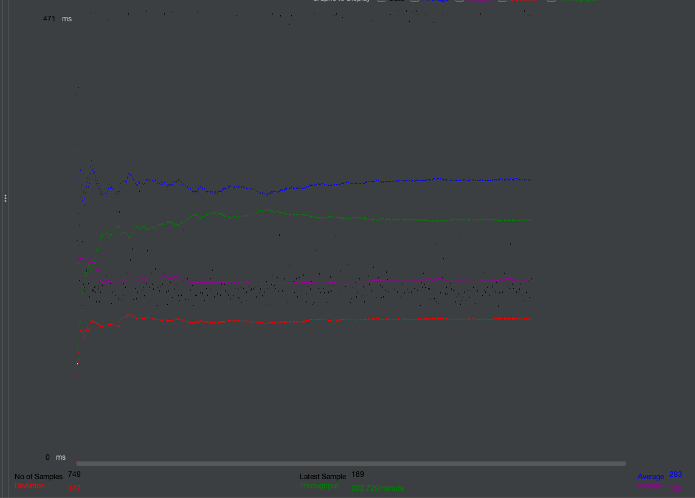
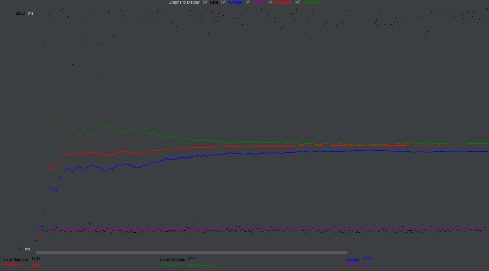
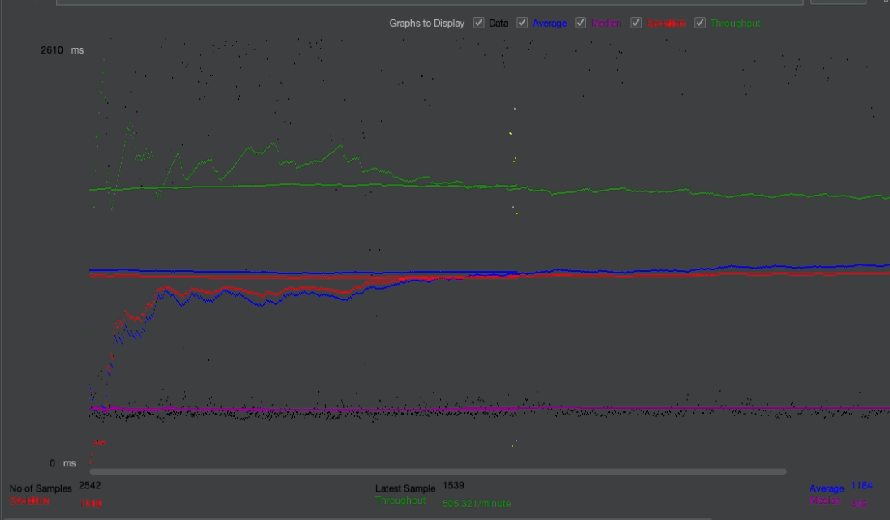
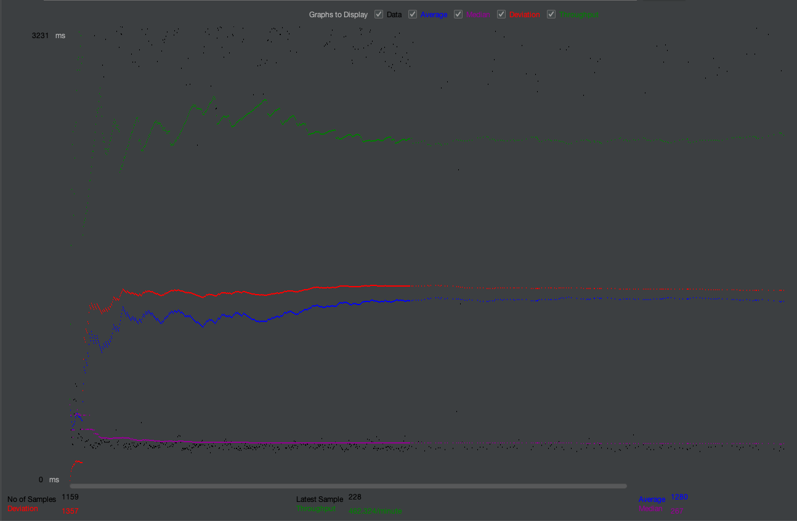
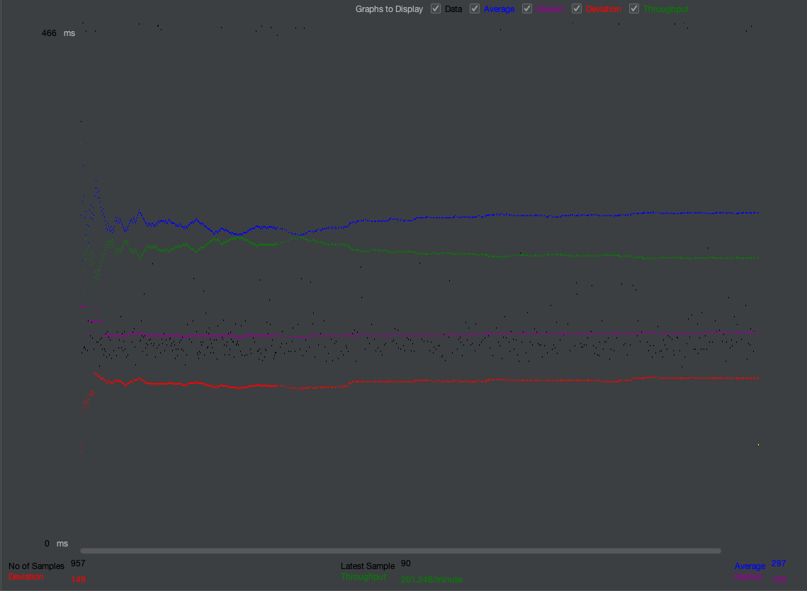

# CS 122B Project

A website that displays information on movies, and movie stars.

## Project 1

### Demo Video

https://drive.google.com/file/d/1nC2yj1NVUM-83Oe-qiXxvxU8_689LRfz/view?usp=sharing**

## Project 2

### Demo Video

https://drive.google.com/file/d/1zUkjeFxbQG0peBYbrL7De1tD-lLi9y_E/view?usp=sharing**

**Note:** Video skips drama page, as it currently times out. Movie from another genre page is used instead for cart demo.

### `LIKE`

When building my query in `FormServlet.java`, I used `LIKE` for `WHERE movies.title LIKE ?` such that this would affect prefixes and keyword searches. Furthermore, this is used for director names and star names. _-Justin_

## Project 3

### Demo Video

https://drive.google.com/file/d/12INMW3vTd-J9ok7w3nWG8w5TMuVFPCSR/view?usp=sharing

### PreparedStatements

- Used in all MySQL queries (all files ending in "Servlet.java")

### Performance Tuning

- Used `BufferedReader` to read file by line as opposed to loading entire file into memory
- Used batched MySQL commands as opposed to a for-loop of `INSERT` statements to massively reduce commit overhead
- Preprocessed invalid data to reduce the number of `INSERT`s that would fail anyway

### Inconsistency Report

- Movies batch insert skipped 374 invalid rows.
- Ratings batch insert skipped 0 invalid rows.
- Genres batch insert skipped 1 invalid rows.
- Genres in Movies batch insert skipped 13 invalid rows.
- Stars batch insert skipped 1 invalid row.

## Project 4

### Demo Video

#### Part 1

https://drive.google.com/file/d/1inxaDPsZR_PC-iQpkcYpJxmqK--F7ASV/view?usp=sharing

#### Part 2

https://drive.google.com/file/d/1U2b-Wt9o6GbglHkoPGanGhGJBJeVhI_M/view?usp=sharing

### Connection Pooling

#### Files using Pooling

> Autocomplete.java, SingleMovieServlet.java, PaymentServlet.java, HomeServlet.java, LoginServlet.java, AddStarServlet.java, FormServlet.java, EmployeeLoginServlet.java, SingleStarServlet.java, SessionServlet.java, MoviesServlet.java, AddMovieServlet.java, AddGenreServlet.java, DashboardServlet.java

#### How is pooling used in FabFlix code?

Connection pooling is used to distribute a limited amount of connections to many clients that are requesting a service.
This prevents too many connections being opened to a single servlet, such as the form servlet, where many people can
constantly be searching, and will prevent a crash if there are many people using FabFlix. It heavily improves the
**scalability** of our app.

Our `PreparedStatements`, which are used in, for example, `FormServlet.java` and `AutoComplete.java` will not just protect
against SQL injection, but also create a kind of query "framework" that can easily be reused each time a query is to be used
with our database. The execution plan will be cached, and just has to be filled with user input.

#### Pooling with 2 Backend Servers

We have defined two datasources in `context.xml`. Right now, they are simply templates using `localhost`, but in each instance,
they route differently depending on the instance.

##### Master:

`jdbc/moviedb` performs read operations, goes to the private address of the slave instance.
`jdbc/moviedbWrite` performs write operations, writes to itself using `localhost`

##### Slave:

`jdbc/moviedb` performs read operations, goes itself using `localhost`
`jdbc/moviedbWrite` performs write operations, writes to the master instance instead of itself using its private address.

The way that pooling is utilized here is that a pool will be made for each of these sources, for example, the _write_ will direct
all writing traffic to the Master's MySQL to be replicated. A read request will be handled by either master or slave database
due to the `context.xml` file that both of these have, with slight differences for redirection.
 
Doing this will allow for a pool of database connections that can be borrowed and returned, using the load balancer (instance #1)
to determine where a request will be led.
 
To put it simply, you want to use `javax.sql.DataSource`, which we have been doing, and have a `context.xml` in these instances
to properly direct a connection request to one of your specified data sources: being an instance itself, or the other instance.
Be sure to use private IP addresses to refer to the other instance.

##### Path:

In the project directory, go to this path for either the master or slave:
 
`WebContent/META-INF/context.xml`

### Master/Slave

#### Include the filename/path of all code/configuration files in GitHub of routing queries to Master/Slave SQL.

`WebContent/WEB-INF/context.xml`

#### How read/write requests were routed to Master/Slave SQL?

Read and write requests are routed to master/slave depending on what is in `/etc/apache2/sites-enabled/000-default.conf`in the load balancer. This is a proxy layer that redirects traffic to those instances specified within that layer using the private IP addresses of the master and slave. Then, within the master and slave, that `WebContent/WEB-INF/context.xml` will have datasources specified, being `moviedb`, and `moviedbWrite`, where the major difference is that writes being sent to the slave will have those MySQL actions sent to the master's MySQL database using its individual `context.xml`.

### JMeter TS/TJ Time Logs

`python log_processing.py [log1] [log2]`

### JMeter TS/TJ Time Measurement Report

| **Single-instance Version Test Plan**         | **Graph Results Screenshot** | **Average Query Time(ms)** | **Average Search Servlet Time(ms)** | **Average JDBC Time(ms)** | **Analysis**                                                                       |
| --------------------------------------------- | ---------------------------- | -------------------------- | ----------------------------------- | ------------------------- | ---------------------------------------------------------------------------------- |
| Case 1: HTTP/1 thread                         |      | 293 ms                     | 593.1138917153154 ms                | 530.5942672012012 ms      | A single thread on a single instance provides a good baseline for further testing. |
| Case 2: HTTP/10 threads                       |     | 1173 ms                    | 988.3768701944445 ms                | 943.709249925926 ms       | Ten threads dramatically slow down processing times across the board.              |
| Case 3: HTTPS/10 threads                      |    | 1184 ms                    | 989.241766933114 ms                 | 875.5360111622807 ms      | HTTPS marginally increases servlet and query time. JDBC is slightly faster.        |
| Case 4: HTTP/10 threads/No connection pooling |   | 1280 ms                    | 1097.9614178302238 ms               | 1038.9273903532337 ms     | Disabling pooling increases processing times across the board slightly.            |

| **Scaled Version Test Plan**                  | **Graph Results Screenshot** | **Average Query Time(ms)** | **Average Search Servlet Time(ms)** | **Average JDBC Time(ms)** | **Analysis**                                                                                                                   |
| --------------------------------------------- | ---------------------------- | -------------------------- | ----------------------------------- | ------------------------- | ------------------------------------------------------------------------------------------------------------------------------ |
| Case 1: HTTP/1 thread                         |          | 297 ms                     | 724.297600607515 ms                 | 648.6446731396051 ms      | Scaling with a single thread increases servlet and JDBC time but has negligible effect in query time.                          |
| Case 2: HTTP/10 threads                       |         | 651 ms                     | 463.49137442249304 ms               | 437.35057699871714 ms     | Ten threads have a longer query time than a single thread. The scaled version is signficantly faster that the single instance. |
| Case 3: HTTP/10 threads/No connection pooling |       | 1268 ms                    | 1054.1967015775672 ms               | 997.0540187309388 ms      | Disabling pooling nearly doubles processing times across the board.                                                            |

## Project 5

### Demo Video

https://drive.google.com/file/d/1MBljuIsefNL-VFnkooKNTanJCYglHyzY/view?usp=sharing

### Service Endpoints

- **Login**: /api/login, login.html, login.js
- **Movies**: /api/cart, /api/home, /api/movies, /api/single-movie, /api/single-star, /api/payment, /api/session-params, /autocomplete, /form, all other .html and .js

## Contributions

### Brian Do

- Movies list page: Controls, sorting, pagination, optimized SQL query to support proper pagination
- Single star/movie pages: Back to list functionality
- Payment and confirmation pages
- Employee dashboard: Filtering/login debugging
- Backend MySQL logic
- CSV data loading and debugging all pages to accomodate missing optional fields
- Full-text search by movie title
- Styling: CSS/Bootstrap
- Time logging (FormServlet & processing script)
- JMeter test plans
- Kubernetes compatibility
- Conversion to Docker
- Conversion to multi-service
- Redis sessions

### Justin Ha

- Single Star/movie pages
- Hyperlinks
- MySQL
- Forms & Searching
- Login
- CSS
- New landing page & searching from landing page and searching from list page
- Initial list.js and list.html
- Movie page genre and star limiting and ordering
- Shopping cart page
- Add to shopping cart
- ReCaptcha & HTTPS
- Employee Dashboard: displaying schema & Adding Genre, Movie, Star
- Stored Procedures
- Autocomplete
